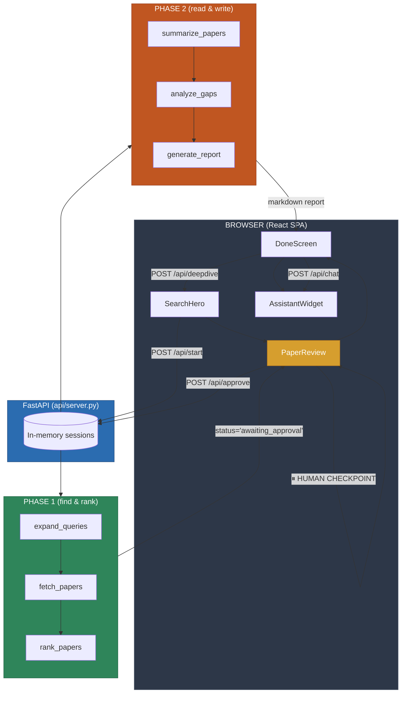

<div align="center">
  
  <h1>Thessori</h1>
  <p>An autonomous literature-review agent that actually reads the paper and stops to show its work.</p>
</div>

<div align="center">
  
</div>

Every research project starts the same way: you have a question, and between you and an answer sit a few hundred papers you haven't read. Finding the relevant ones, reading them, and noticing what nobody has tried yet is mechanical work — right up until the moment it isn't.

Most tools wait until you've already gathered the papers. **Thessori starts one step earlier.** 

You give it a research question. It searches arXiv and Semantic Scholar in parallel, has Qwen quietly rank the results, and stops. You get a checklist of the top candidate papers so you can throw out the ones that don't belong. After that, it pulls down the actual PDFs, reads the body text (not just the abstract), writes structured summaries, maps out the gaps across the whole set, and assembles everything into a clean Markdown review. When it's done, you can chat with the report or click "Deep Dive" to send the agent back out after the open threads it just found.

Built for the **Qwen Cloud Autopilot Agent Hackathon**.

## Why this is different

- **It reads the body, not just the abstract:** Abstracts are marketing. They oversell the contribution and bury the limitations. Thessori downloads the arXiv PDF, reads up to the first 25 pages (keeping the introduction, methods, results, and limitations), and summarizes the actual paper.
- **Human-in-the-loop checkpoint:** Autonomous agents often run off a cliff because the ranking model isn't psychic. Thessori pauses midway. It shows you the candidate papers, lets you untick the bad ones, and only proceeds to the expensive PDF reading step on the papers you actually approved.
- **Follows the threads:** The final gap analysis generates follow-up queries. One click on "Deep Dive" and the agent starts a fresh run on the gaps it just found—which is how real research actually works.

<div align="center">
  
</div>

## How it works

The backend is an explicit LangGraph state machine wrapped in FastAPI. I chose a state machine over a free-roaming agent loop so I know exactly what happens on every run. 

There are two compiled LangGraph graphs because the pipeline pauses for a human in the middle. The browser is what carries the state across the gap.



<div align="center">
  
</div>

## Running it (Easiest Way: Docker)

Thessori uses Qwen via an OpenAI-compatible endpoint. All you need is Docker and an API key.

1. Create a `.env` file (or rename `.env.example`) and add your Qwen API key:
```env
QWEN_MODEL=qwen-plus
QWEN_BASE_URL=https://dashscope.aliyuncs.com/compatible-mode/v1
QWEN_API_KEY=your_key_here
```

2. Run Docker Compose:
```bash
docker compose up --build -d
```
Thessori will be live at `http://localhost:8000`. Your generated reports and sessions will automatically persist to the `./output` directory.

### Running it manually (Without Docker)

If you prefer to run the raw processes:

1. Install dependencies:
```bash
pip install -r requirements.txt
npm --prefix frontend install
```

2. Run the backend and frontend in development mode:
```bash
# Terminal 1: Backend (loads from .env automatically)
uvicorn api.server:app --reload --port 8000

# Terminal 2: Frontend
npm --prefix frontend run dev
```

For a full local production build, run `npm --prefix frontend run build` then serve via `uvicorn api.server:app --port 8000`.

## Architecture details that aren't obvious
- **StateGraph(ResearchState):** LangGraph needs a real `TypedDict`. Using a bare `dict` schema causes unmodified keys to drop off between nodes.
- **Fail-safe fetch:** The `fetch_papers` node uses `asyncio.gather(..., return_exceptions=True)`. Semantic Scholar heavily rate-limits without an API key, so if it fails, the run safely degrades to just arXiv results instead of killing the entire pipeline.
- **Streaming Assistant:** The chat at the end is a true `text/plain` stream, making it feel alive and responsive. The backend parses out action tokens after the stream finishes if the model decides it needs to search again.

## License

This project is Open Source under the MIT License.

## Author

**Waddah Ali**
- [LinkedIn](#) <!-- Replace with your actual LinkedIn URL -->
- [GitHub](#) <!-- Replace with your actual GitHub URL -->
- [Kaggle](#) <!-- Replace with your actual Kaggle URL -->
