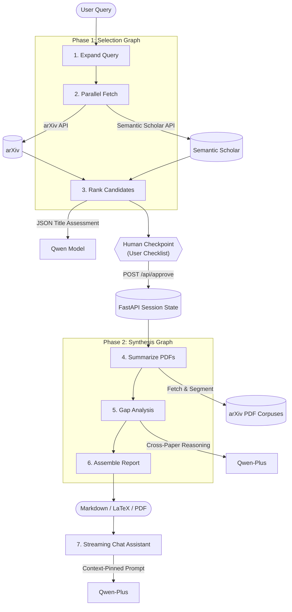

<div align="center">
  
  <h1> Thessori</h1>
  <p>An autonomous literature-review agent that actually reads the paper and stops to show its work.</p>
  <p><strong> <a href="https://thessori.vercel.app/">Try Thessori Live</a> </strong></p>
</div>

Every research project starts the same way. You have a question, and between you and an answer sit a few hundred papers you haven't read. Finding the relevant ones, reading each, and noticing what nobody has tried yet is mechanical work  right up until the moment it isn't. 

Most tools that promise to help only kick in after you've already gathered the papers. Thessori starts one step earlier. You give it a research question, and it hands back a literature review you could actually put in front of someone. 

Built for the Qwen Cloud Autopilot Agent track, Thessori is designed around a simple thesis: autonomous agents shouldn't make decisions in a black box, and they shouldn't summarize abstracts. 

---

## The Blueprint

The backend is built as an explicit state machine using LangGraph, served via FastAPI, and coupled with a React single-page application. The architecture is split into two distinct phases separated by a physical human checkpoint.



---

## The Reasoning Layer

Orchestrating an LLM to perform systematic literature synthesis requires moving past simple prompting. Standard models fail at this task for three specific reasons:

1. **Abstract Bias:** If you feed a model an entire paper, or just its abstract, it tends to parrot the authors' marketing. The abstract is designed to sell the paper; it routinely glosses over methodological compromises and buries the limitations.
2. **Context Dilution:** Dumping multiple 25-page PDFs into a single prompt causes the model to lose track of fine-grained details in the middle of the texts.
3. **Structured Failure:** Query expansion and candidate ranking require strict, structured outputs. Under high-temperature settings, standard models frequently output conversational filler or invalid JSON that breaks downstream parsers.

Thessori solves these issues by structuring Qwen's reasoning path into distinct, specialized tasks:

### 1. Structured Query Expansion
Before searching, the agent refines the user's query into three distinct academic search terms. We use Qwen's native JSON mode to guarantee a clean string array:
```python
response = await client.chat.completions.create(
    model="qwen-plus",
    messages=[{"role": "system", "content": EXPANSION_PROMPT}, ...],
    response_format={"type": "json_object"}
)
```
This prevents the agent from silently searching for something other than what the user asked, while ensuring the search queries target different conceptual angles.

### 2. Targeted PDF Segmentation
Instead of feeding Qwen the raw, unparsed PDF, the agent slices the document. We extract the introduction and methodology (the first 10 pages) and the results, discussion, and limitations (the last 10 pages), bypassing the narrative middle. Qwen is then prompted with a highly constrained system prompt to extract exactly four keys:
* **Contribution:** The core thesis or artifact introduced.
* **Method:** The mathematical or experimental setup.
* **Findings:** The empirical results.
* **Limitations:** The compromises or failure modes the authors left out of the abstract.

### 3. Cross-Document Synthesis
During the gap analysis phase, Qwen-plus acts as a critical peer reviewer. Instead of summarizing the papers again, it receives the concatenated summaries of all approved papers and is prompted to find contradictions and omissions (e.g., "Paper A uses method X, but Paper B warns that method X fails under condition Y"). 

Alongside the prose, Qwen generates three follow-up queries representing the unresolved gaps it identified. These are returned as a structured JSON array to feed the **Deep Dive** feature.

---

## The Multi-Agent Orchestration

We chose an explicit state machine over a free-roaming agent loop. The state itself is governed by a single load-bearing contract:

```python
class ResearchState(TypedDict):
    session_id: str
    queries: list[str]
    original_queries: list[str]
    use_ai_expansion: bool
    max_papers: int
    top_k_papers: int
    raw_papers: list[dict]
    approved_papers: list[dict]
    summaries: list[dict]
    gap_analysis: str
    deep_dive_queries: list[str]
    markdown_report: str
    status: str
    error: str | None
    timestamp: str | None
    model: str | None
```

Using an explicit `TypedDict` schema ensures that LangGraph treats each key as a persistent channel. In an untyped `dict` schema, partial updates returned by a node cause the remaining keys to fall away; with `ResearchState`, updates merge cleanly across steps.

### The HTTP Session Bridge
A typical LangGraph application relies on a persistent checkpoint store (like Postgres or Redis) to handle interrupts and human-in-the-loop pauses. To keep the deployment lightweight and avoid database overhead, Thessori splits the pipeline into two separate graphs:

1. **Phase 1 (Find & Rank):** Runs `expand`, `fetch`, and `rank`, then terminates. The FastAPI backend caches the state in an in-memory session store and returns the ranked candidates to the React frontend.
2. **The Pause:** The React frontend renders the candidates as a checklist and waits for the user to approve or reject papers.
3. **Phase 2 (Read & Write):** When the user clicks "Generate", the frontend sends a POST request to `/api/approve` containing the approved IDs. The backend retrieves the cached state, updates the `approved_ids`, and invokes the second graph (`summarize`, `gaps`, `report`).

This design keeps the state machine stateless from a deployment perspective, relying on the HTTP boundary to manage the pause.

---

## Behind the Scenes

If you want to know where a project like this actually spends its time, it isn't the headline feature. These are the real engineering hurdles we ran into during development:

### The Dependency Wheel Problem
Before writing a single line of application code, `pip install` failed on a clean machine running the latest Python interpreter. Pinned versions of core libraries had no prebuilt wheels, causing pip to attempt to compile Pydantic's Rust core from source and eventually crash. We resolved this by shifting from exact version pinning to floor pins (`library>=version`), allowing the resolver to fetch current releases that ship with prebuilt wheels for newer interpreters.

### Semantic Scholar Throttling
During testing, Semantic Scholar's free API rate-limited the agent, returning `429` status codes. Initially, our fetch step ran under a plain `asyncio.gather`, meaning a single API failure would crash the entire node. We rewrote the fetch node to handle exceptions gracefully:
```python
results = await asyncio.gather(
    fetch_arxiv(queries),
    fetch_semantic_scholar(queries),
    return_exceptions=True
)

candidates = []
for res in results:
    if isinstance(res, Exception):
        logger.error(f"Source fetch failed: {res}")
        continue
    candidates.extend(res)
```
If Semantic Scholar throttles the request, the agent logs the error and continues running on the arXiv results, ensuring the application remains functional.

### LaTeX Escaping
The export engine converts the generated Markdown report into a `.tex` file using a series of regex patterns. In early builds, the converter left special characters in the body prose untouched. When a summary contained a percent sign (`%`) or an underscore (`_`), the resulting LaTeX file failed to compile because `%` initiated a comment and `_` is illegal outside math mode. We rewrote the converter to walk the text as tokens, escaping raw LaTeX control characters while leaving markdown bolding, links, and inline math blocks intact.

### WebGL Canvas Cleanup
The React landing page features an animated WebGL shader background. During development, the entire application would occasionally crash to a black screen. The cause was React's `StrictMode`, which mounts components twice in development. Our cleanup function was destroying the WebGL context on the first unmount, causing the immediate re-mount to try to initialize on a dead canvas and throw an uncaught error. The fix was wrapping the WebGL setup in a try/catch block that degrades gracefully to a CSS gradient if the graphics context fails, preventing a background failure from taking down the entire app.

---

## Repository Structure

```text
.
├── agent/
│   ├── graph.py           # LangGraph state machine compilation
│   ├── nodes.py           # Qwen execution nodes (expand, rank, summarize, gaps)
│   ├── report.py          # Markdown/LaTeX compilation & formatting logic
│   ├── tools.py           # arXiv & Semantic Scholar parallel fetchers
│   └── progress.py        # Pipeline checkpoint progression tracking
├── api/
│   └── server.py          # FastAPI application, session store, & chat streaming
├── frontend/              # React single-page application
├── Dockerfile             # Multi-stage build for single-port production
├── docker-compose.yml     # Local orchestration configuration
└── nginx.conf             # Static asset and API routing configuration
```

---

## Setup & Installation

### Option A: Running with Docker (Recommended)
All you need is Docker and a Qwen API key.

1. Create a `.env` file in the root directory:
```env
QWEN_MODEL=qwen-plus
QWEN_BASE_URL=https://dashscope.aliyuncs.com/compatible-mode/v1
QWEN_API_KEY=your_qwen_api_key_here

# Optional: Map UI model categories to custom variants (falls back to QWEN_MODEL)
# QWEN_MODEL_PLUS=qwen-plus-2025-07-28
# QWEN_MODEL_MAX=qwen-max-latest
```

2. Start the services:
```bash
docker compose up --build -d
```
The application will be live at `http://localhost:8000`. Generated reports and sessions are saved locally to the `./output` directory.

### Option B: Running Manually
If you prefer to run the backend and frontend processes directly:

1. **Install dependencies:**
```bash
pip install -r requirements.txt
npm --prefix frontend install
```

2. **Configure environment:**
Create a `.env` file in the root directory with your `QWEN_API_KEY`.

3. **Start the backend:**
```bash
uvicorn api.server:app --reload --port 8000
```

4. **Start the frontend:**
```bash
npm --prefix frontend run dev
```
The development server will run at `http://localhost:5173`, proxying API requests to the backend on port 8000.

---

## License

This project is open-source and licensed under the [MIT License](LICENSE).
